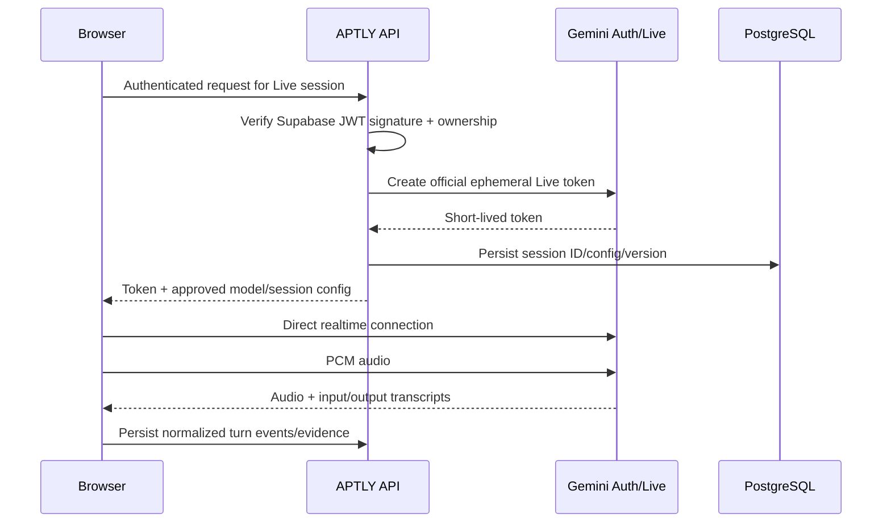
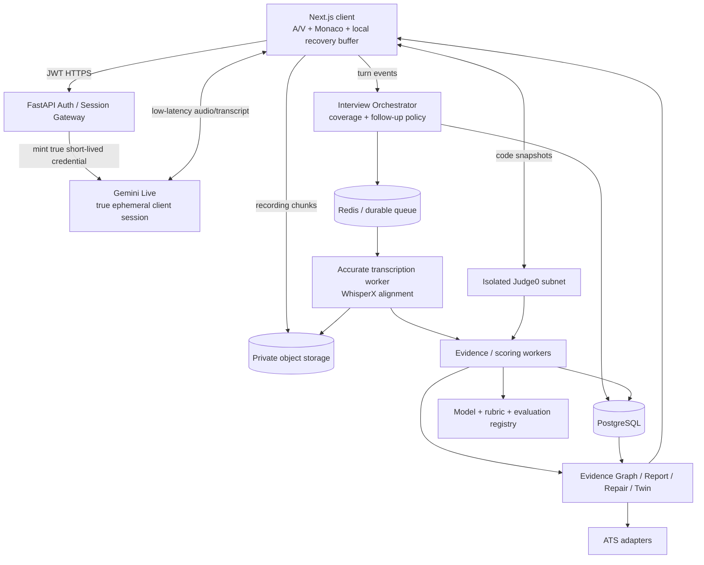
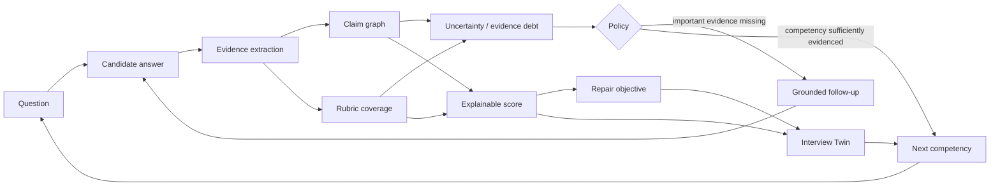
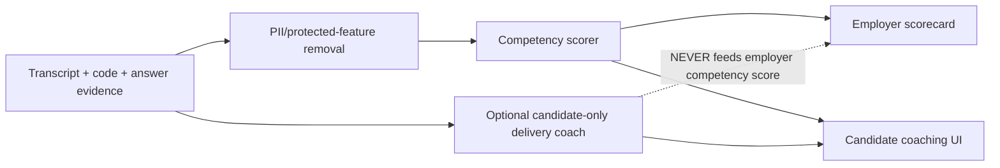
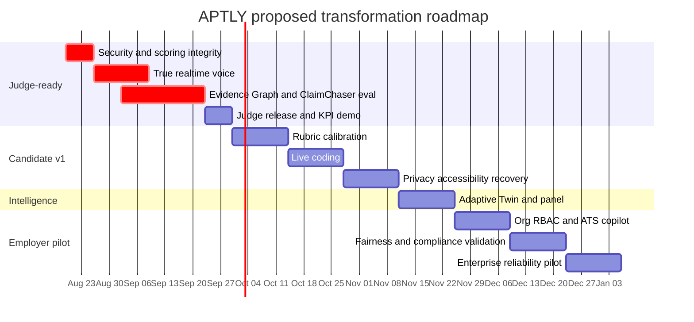

# APTLY Interview Assistant: Market Analysis and Judge-Impressing Product Plan

## Executive summary

**Audit scope.** The supplied GitHub URL appears to contain a branch-name typo: the matching branch I found and audited is `feature/realtime-voice-executive-report-and-progress`, not the trailing-`this` form in the prompt. The audited branch contains a Next.js/React frontend, FastAPI/Python backend, PostgreSQL persistence, Redis infrastructure, media capture/normalization, evidence-linked transcript analysis, adaptive follow-ups, Repair Mode, longitudinal “Interview Twin” logic, experimental realtime voice, behavioral telemetry, panel-scoring concepts, and Supabase integration. fileciteturn5file0L1-L2 fileciteturn10file0L1-L10

**Verdict:** this is already more interesting than a typical “LLM asks five interview questions” hackathon project. Its strongest product primitives are **ClaimChaser**, evidence-linked scoring, adaptive follow-ups, Repair Mode, and the Interview Twin. The repository’s stated philosophy—deterministic measurement first, AI interpretation second—is also the right direction for a defensible assessment/coaching product. fileciteturn5file0L1-L2

However, **the current branch should not yet be presented as production-ready or as genuinely superior to human interviewers**. Four issues are immediate blockers:

1. **Authentication is not cryptographically verified.** `decode_supabase_token()` extracts unverified JWT claims rather than verifying the JWT signature, while the rate limiter is explicitly a no-op. A malicious caller could potentially forge identity claims. fileciteturn13file0L1-L6 Supabase's documented approach is to verify claims using its signing keys/JWKS before trusting identity. citeturn15search0turn15search6
2. **The Gemini Live “ephemeral token” implementation is not a real Google-issued ephemeral token.** The backend hashes the API key, interview ID, and timestamp locally and then sends that hash as a Gemini API key. fileciteturn14file0L1-L6 Google's documented Live API flow requires creating a short-lived token through its authentication-token provisioning service. citeturn7search0
3. **Current visual-behavior analysis is scientifically unsuitable for scoring.** It approximates a face using RGB “skin tone” rules and center-of-mass calculations, then produces attention/head-pose-like measurements with hard-coded high confidence values. fileciteturn16file0L1-L6 This should be removed from scoring, not polished. Where framing/head pose is useful for candidate coaching, a real landmark system such as MediaPipe Face Landmarker is substantially more appropriate. citeturn7search9
4. **Some longitudinal scores are fabricated when data are missing.** Interview Twin substitutes values such as content `75.0`, evidence `70.0`, structure `70.0`, and WPM `140.0` when measurements are unavailable, even though the service says it should “Never fake data.” fileciteturn22file0L1-L6 For a product whose moat is evidence-backed evaluation, missing data must remain missing.

The market has also moved beyond “AI interviewer” as a differentiator. HackerRank now markets voice-based AI technical screening/mock interviews, CodeSignal sells AI Interviewers, Exponent offers AI audio mock interviews, and HireVue combines AI-supported interviewing, transcription, insights, assessments, and enterprise workflows. citeturn8search12turn8search0turn9search7turn18search10

Therefore the winning positioning should be:

> **APTLY is not an AI that asks interview questions. It is an evidence-seeking interview engine that remembers every claim, adapts to what remains unproven, explains every score with source evidence, and turns repeated sessions into a personalized Interview Twin.**

The project should define “outperform a human interviewer” narrowly and demonstrably: **higher consistency, better competency coverage, better recall of candidate claims, faster evidence retrieval, adaptive follow-up quality, 24/7 availability, and longitudinal coaching** than an individual human mock interviewer. It should **not** claim superior autonomous hiring judgment until controlled validation establishes that.

Because **target market, budget, monetization, deployment environment, production SLOs, data-residency requirements, and legal/compliance ownership are unspecified**, the recommended market entry is candidate coaching first, universities/bootcamps second, human-interviewer assist third, and automated employer assessment only after formal validation and compliance work.

A realistic execution sequence is:

| Milestone | Proposed timing | Outcome |
|---|---:|---|
| Judge-quality proof | ~6 weeks | Secure, genuinely realtime, adaptive evidence-seeking voice mock with measured KPIs |
| Candidate product v1 | ~12 weeks | Voice + coding + calibrated scoring + Repair + progress + privacy controls |
| Employer-assisted pilot | ~16 weeks | Org tenancy, interviewer copilot, ATS integration |
| Enterprise assessment pilot | ~20+ weeks | Fairness validation, compliance controls, proctoring/integrity, enterprise operations |

Those timings are engineering estimates, not current repository commitments.

## Repository audit

The existing implementation is a monorepo-like application with `apps/api` and `apps/web`. The backend further separates API routes, configuration, domain definitions, models, repositories, schemas, and services; it also includes Alembic migrations, tests, diagnostics, and an OpenAPI artifact. fileciteturn3file0L1-L10 fileciteturn4file0L1-L10 fileciteturn10file0L1-L10

The README describes a coherent candidate loop: job description → structured role profile → generated interview → browser camera/microphone capture → normalized recording → word-timestamped transcript → deterministic speech analysis → structured content analysis → adaptive follow-up → evidence-linked report → Repair Mode. fileciteturn5file0L1-L2

The backend service tree goes substantially beyond the original MVP, containing adaptive interviewing, behavior analysis, Answer DNA/content intelligence, an Interview Twin, panel logic, media normalization, question generation, Repair Mode, role analysis, and session-memory functionality. fileciteturn11file0L1-L2

| Area | Current state | Audit finding |
|---|---|---|
| Web application | Next.js 16.3.1, React 19.2.8, TypeScript, Supabase client, React Query, Three.js, Zod; Playwright/Vitest present. fileciteturn8file0L1-L6 | Modern and appropriate. The interview page has accumulated considerable responsibility; realtime/capture/scoring state should be extracted into explicit session stores/controllers. |
| API | FastAPI, Pydantic 2, SQLAlchemy async, Alembic, asyncpg, Redis client, Google GenAI, structured logging. fileciteturn6file0L1-L6 | Good service boundaries for an MVP. `InterviewService` is becoming a large orchestration service and should be decomposed before queue/worker expansion. |
| Persistence | PostgreSQL models for interviews, jobs, questions, answers, transcripts, content/speech metrics, behavior, memory and conversation turns. fileciteturn18file0L1-L2 | Strong foundation. Needs immutable scoring-run/evidence/version entities for auditability. |
| Interview state | Interview entity records state, configuration, timestamps and scoring/metric version strings. fileciteturn19file0L1-L6 | Version fields are an excellent start. Replace free-form state strings with validated enums/state transitions and optimistic concurrency/idempotency. |
| Media | Browser MediaRecorder, FFmpeg normalization, local or Supabase object storage. README documents 16 kHz mono WAV normalization and opaque storage keys. fileciteturn5file0L1-L2 | Useful post-session pipeline. Production needs resumable uploads, object lifecycle policies, malware/magic-byte validation and asynchronous processing. |
| Speech | Deterministic WPM/fillers/pauses plus mock/WhisperX-oriented transcription abstraction. fileciteturn5file0L1-L2 | Concept is good. WhisperX/faster-whisper are not declared in the core backend dependency list, so the “real transcription” environment is not fully reproducible from `pyproject.toml`. fileciteturn6file0L1-L6 |
| Content intelligence | Relevance, depth, completeness, structure, evidence, STAR, claims, adaptive follow-ups. fileciteturn5file0L1-L2 | This is the most defensible product layer, provided it is calibrated against human labels. |
| ClaimChaser | Extracts quantitative, scale, ownership and causal claims, looks for evidence gaps, and forms answer-grounded probes. fileciteturn21file0L1-L6 | Excellent differentiator. Current regex heuristics and confidence values need labeled calibration; `0.95` should never mean “we happened to match a regex.” |
| Repair Mode | Existing targeted re-practice loop. fileciteturn5file0L1-L2 | Keep and elevate. Competitors commonly stop at feedback; repeated measured repair is a stronger learning loop. |
| Interview Twin | Builds longitudinal patterns after multiple completed sessions. fileciteturn22file0L1-L6 | Strong concept, but missing-value substitution currently contaminates integrity. |
| Realtime voice | New Gemini Live token route and browser WebSocket hook. fileciteturn14file0L1-L6 fileciteturn15file0L1-L6 | Architectural proof-of-concept, not complete Live API integration yet. |
| Visual delivery | Custom browser pixel/skin-tone heuristic. fileciteturn16file0L1-L6 | P0 removal from any evaluative score. |
| Local infrastructure | Docker Compose runs PostgreSQL 16 and Redis 7. fileciteturn20file0L1-L6 | Development-only foundation. API, web, workers, observability and production gateway are not represented. |
| Authentication | Supabase-oriented JWT utility and nullable interview `user_id`. fileciteturn13file0L1-L6 fileciteturn19file0L1-L6 | Critical vulnerability: token claims are read without signature verification. |
| Rate limiting | Interface exists but always returns `True`. fileciteturn13file0L1-L6 | Production blocker. |
| Upload security | MIME allowlist and 500 MB max defined; source comments note magic-byte inspection is future. fileciteturn13file0L1-L6 | Add reverse-proxy limits, magic-byte/codec inspection, quotas and abuse protection. |

The realtime implementation deserves special attention. Google's Live API supports stateful bidirectional realtime audio/video/text over WebSockets, including audio output and transcription configuration. citeturn7search1turn7search2 The current frontend captures 16 kHz microphone PCM and sends chunks, but its `partialInputTranscript` is not populated, `liveWpm` is initialized but not computed, and audio-output playback is not implemented as a complete model-audio pipeline. fileciteturn15file0L1-L6 More importantly, the branch's backend manufactures its own token string rather than requesting a Google ephemeral token. fileciteturn14file0L1-L6 Google's official ephemeral-token mechanism explicitly requires a backend provisioning call and permits short-lived direct client connections without revealing the long-lived server credential. citeturn7search0

A secure realtime flow should therefore become:



The highest-priority technical debt is consequently:

| Priority | Debt | Corrective action |
|---|---|---|
| **P0** | Unverified Supabase JWT claims | Verify signature, issuer, expiry and audience against Supabase JWKS; make authenticated identity mandatory for private resources; enforce row ownership/RLS. Supabase explicitly documents signed JWT verification and RLS integration. citeturn15search0turn15search4 |
| **P0** | Fake Gemini ephemeral token | Replace with Google's documented ephemeral-token provisioning mechanism and official SDK/protocol. citeturn7search0 |
| **P0** | Pixel/skin-tone “face” heuristic | Delete from scoring immediately; feature-flag it off until replaced with opt-in observable landmarks, or simply omit visual scoring. fileciteturn16file0L1-L6 |
| **P0** | Fabricated fallback performance values | Represent missing metrics as `NULL/not_evaluated`; prohibit scoring runs without minimum evidence. fileciteturn22file0L1-L6 |
| **P1** | Inline media/scoring processing | Redis-backed durable job queue, workers, idempotency keys, retry/dead-letter policy, artifact state machine. README itself identifies inline request processing as the current path. fileciteturn5file0L1-L2 |
| **P1** | No-op rate limiter | Redis sliding/token bucket limits by user, IP, endpoint and cost class. fileciteturn13file0L1-L6 |
| **P1** | Uncalibrated scoring/confidence | Gold-set evaluation, confidence calibration, immutable scoring versions, disagreement handling. |
| **P1** | Realtime session incompleteness | Correct setup, transcript events, audio playback, VAD/turn handling, retries, session resumption and metrics. |
| **P1** | Non-reproducible real transcription dependency | Pin and isolate WhisperX/faster-whisper worker image. WhisperX is designed for word-level timestamp alignment using VAD and forced alignment. citeturn14academia37 |
| **P2** | Missing enterprise/platform surface | Org tenancy, RBAC/SSO, audit logs, ATS/HRIS, deletion/retention console, billing/entitlements, accessibility and operational observability. |

Several operational details are **unspecified** in the repository evidence reviewed: production cloud/provider, production deployment topology, budget, target-market segment, monetization, SLO/error budget, regional data residency, disaster-recovery targets, incident-response process, DPO/privacy ownership, enterprise support model, and formal security certification plans.

## Market and competitive landscape

The competitive landscape falls into two overlapping markets.

The first is **enterprise hiring infrastructure**: HireVue, HackerRank, Codility, CodeSignal, CoderPad, Mercer | Mettl and Spark Hire compete around structured interviews, technical assessment, anti-cheating/proctoring, analytics, ATS integrations and organizational scale. HireVue combines live/on-demand video, structured interview tooling, assessments and AI-generated interviewing insights; HackerRank combines technical assessment, interviewing, coding environments and increasingly AI-mediated technical screening; Codility and CodeSignal have substantial assessment/integrity stacks; Mettl operates large-scale assessment/proctoring infrastructure. citeturn18search1turn18search2turn8search9turn8search7turn8search0turn10search12

The second is **candidate practice**: Interviewing.io, Exponent/Pramp and LeetCode emphasize realistic practice, human/peer feedback, coding environments and question inventory. Interviewing.io combines anonymous human interviews with AI coding/system-design interviewing; Pramp was migrated into Exponent Practice, which combines peer video practice, shared coding tools and AI feedback/audio mock modes; LeetCode's principal strength remains its enormous coding/problem-preparation corpus and company-oriented practice. citeturn20search1turn9search5turn9search6turn9search7turn11search14

The implication is important: **realtime AI voice is now table stakes, not a moat**. The moat has to be what happens *inside and after* the conversation.

Legend: **✓** strong/native capability; **◐** partial, adjacent or dependent on plan/workflow; **—** not a core capability found in the reviewed official product materials; **U** unspecified in the verified public material.

| Product | Video / voice | Live coding | Automated scoring | Feedback | Analytics | Question bank | Proctoring / integrity | Integrations | Public pricing snapshot | Scalability |
|---|---|---|---|---|---|---|---|---|---|---|
| **HireVue** | ✓ live + on-demand video | ◐ technical assessment rather than shared pair-coding in sources reviewed | ✓ | ✓ | ✓ transcripts, competency tags, talk-time/consistency insights | ✓ structured/assessment content | ◐ enterprise assessment controls; exact bundle varies | ✓ ATS ecosystem | Quote-based tiers; candidate access is free. citeturn8search5 | Enterprise; security/compliance program includes SOC 2 Type II, ISO 27001 and GDPR claims. citeturn8search5 |
| **HackerRank** | ✓ including newer voice-based technical AI screening | ✓ full coding environment | ✓ tests + AI-assisted scorecards | ✓ | ✓ | ✓ 2,000+ on Starter; 7,500+ stated for higher enterprise library | ✓ plagiarism/proctoring/identity capabilities by tier | ✓ ATS, SSO/SCIM at enterprise level | Starter advertised at $199/month or $1,990 annual in current official material. citeturn8search6 | Major enterprise suite. citeturn8search9turn8search11 |
| **Codility** | U | ✓ | ✓ | ✓ | ✓ | ✓ coding, SQL, MCQ, AI tasks | ✓ snapshots/basic through premium proctoring | ✓ custom tier | Starter $1,200 annual; Scale page shows $6,000; custom enterprise plans. citeturn8search7 | Enterprise custom plan with SSO/integrations and assessment validation. citeturn8search7 |
| **CodeSignal** | ◐ AI Interviewers; exact A/V modality varies by experience | ◐ strong technical assessment/interviewer stack | ✓ | ✓ | ✓ | ✓ roughly 2,000 questions on Build | ✓ AI proctoring and ID verification | ✓ ATS on higher tiers | Build $79/month billed annually or $99 monthly; higher Grow/Pro tiers available. citeturn8search0 | Enterprise Pro with RBAC/integrations/security controls. citeturn8search0 |
| **CoderPad** | U as a core differentiator | ✓ one of its central products | ◐ structured scorecards; AI Reviewer on higher tier | ✓ | ✓ code playback/scorecards | ✓ substantial technical library | — as core positioning | ✓ Greenhouse, Lever, iCIMS, SAP and others | Free tier; Team listed at $400/month; Custom enterprise. citeturn10search14 | Enterprise collaboration/security with SOC 2 Type II claim. citeturn10search15 |
| **Mercer \| Mettl** | ✓ video interviewing | ✓ coding interview/assessment | ✓ | ✓ reports | ✓ | ✓ broad assessment catalogue | ✓ major strength: ID/authentication and remote proctoring | ✓ ATS/LMS/LTI/REST | Tailored/pay-as-you-go; exact contract pricing varies. citeturn10search20 | Official materials cite 6,000+ customers, 25M+ assessments annually, 100+ countries and 200,000+ proctored assessments/day. citeturn10search12turn10search20 |
| **Spark Hire** | ✓ live + one-way video | — | ✓ AI scoring | ✓ scorecards/summaries/transcripts | ✓ | ◐ configurable interview questions rather than technical bank moat | — as core feature | ✓ 40+ ATS plus Zapier | $299 monthly or $249/month on annual billing for video interviewing in reviewed pricing. citeturn9search4 | Unlimited interview/job/user allowances on relevant plans and enterprise ATS workflows. citeturn9search4 |
| **Interviewing.io** | ✓ anonymous audio/chat; product explicitly avoids video in anonymous sessions | ✓ own coding pad | ◐ AI interviewer evaluation, not enterprise auto-decisioning | ✓ detailed human/AI feedback | ◐ personal practice analytics | ✓ 200+ free problems stated | — | — as core | Human premium mocks start around $179 in current official materials; AI/free practice also exists. citeturn20search3 | Consumer/professional practice network rather than enterprise assessment infrastructure. citeturn20search1 |
| **Exponent Practice / Pramp** | ✓ peer video; AI audio mocks | ✓ shared editor for relevant interview types | ✓/◐ AI rubric feedback in supported modes | ✓ peer + AI | ◐ | ✓ role/type-specific content | — | — | Peer practice remains free with usage/credit structure; memberships provide broader/unlimited access, while exact current membership price is not established in the reviewed source. citeturn9search5turn9search10 | Community-scale practice platform. |
| **LeetCode** | — | ◐ coding/simulation rather than conversational pair interviewing | ✓ code judge | ◐ solutions/editorials/mock results rather than rich interview coaching | ✓ progress/performance | ✓ 2,000+ authentic/company-oriented problems reported in official help material | — | — | Freemium + Premium; current base Premium price is **unspecified in the verified current sources reviewed** | Very large global consumer practice ecosystem. citeturn11search14turn11search4 |

HireVue's newer Interview Insights can generate transcripts and summarize/tag competencies, while HackerRank's Scorecard Assist can use transcript, code and tests to help populate structured interviewer rubrics. citeturn18search10turn8search9 This is exactly why APTLY should not position “AI feedback” as novel.

APTLY's competitive gap and opportunity are better expressed as follows:

| Dimension | Most competitors | Winning APTLY position |
|---|---|---|
| Question generation | Static bank or LLM-tailored prompts | **Evidence-seeking question policy** that changes based on what the candidate has and has not proven |
| Score | Aggregate number/rubric | **Every score is traceable to transcript/code/timestamp evidence** |
| Follow-up | Generic or interviewer-selected | **ClaimChaser:** challenge numbers, causal assertions, ownership and missing validation |
| Session memory | Limited history/trends | **Interview Twin:** longitudinal evidence debt and calibrated skill trajectory |
| Feedback | End-of-session report | **Repair Mode:** immediately re-answer precisely the weakest evidence gap |
| Human consistency | Interviewer-dependent | Same rubric, same evidence rules, scoring version, confidence and audit trail |
| Technical + behavioral | Often separate products | Voice conversation + behavioral evidence + coding + system-design artifacts in one session model |
| Explainability | Summary text | Evidence graph showing exactly why an assessment changed |
| Bias control | Often opaque to candidate | Blind competency score path separated from optional delivery coaching |
| Learning value | “You scored 72” | “Your ownership claim was unsupported at 02:14; here is the missing evidence; prove it now.” |

The strongest entry market is therefore **candidate-owned interview intelligence**, not immediate automated employer hiring. Candidate coaching provides repeated sessions—the data needed for Interview Twin and adaptive calibration—while producing lower regulatory exposure than making employment decisions. Universities, bootcamps and workforce-development programs are the natural B2B2C extension. Employer products should initially be **interviewer-assist**, where the system improves consistency and evidence coverage but the human remains the decision-maker.

A pricing hypothesis worth testing—not a claim about established willingness to pay—is: free limited practice; **$19–$29/month candidate Pro**; volume institutional contracts for schools/bootcamps; and custom enterprise pricing once ATS/security/compliance features exist. Target market and budget remain **unspecified**, so these should be treated as experiments, not fixed strategy.

## Baseline product plan

Effort estimates below assume the repository is reused rather than rewritten. **Low** means roughly 2–5 engineer-days, **Medium** roughly 1–2 engineer-weeks, and **High** roughly 3–6 engineer-weeks. Parallel calendar estimates assume approximately five to seven contributing FTEs across frontend, backend/platform, ML/evaluation, product/design and QA/security.

| Priority / feature | Technical implementation | Required components / APIs | Core data additions | Security & privacy | Effort / rough timing |
|---|---|---|---|---|---|
| **MVP — Verified identity and private sessions** | Replace unverified claim parsing with JWKS-backed JWT verification; require user identity for owned objects; enforce ownership both in API queries and Supabase/Postgres policies | Supabase Auth/JWKS; existing FastAPI dependencies | `Profile`, optional `Organization`, `ConsentEvent`, security/audit events; retain external auth subject | Verify signature/issuer/exp; RLS; secure cookies/token handling; signed media URLs; deny-by-default access | **Medium; week 1**. Supabase recommends verified claims/JWKS and RLS rather than trusting unverified claims. citeturn15search0turn15search4 |
| **MVP — Real realtime voice interviewer** | Backend provisions true ephemeral credential; browser uses official Live connection; configure system prompt, input/output transcription, PCM streaming, native model audio, VAD/interruption, reconnection | Gemini Live API/SDK | `RealtimeSession`, `ConversationTurn`, `RealtimeEvent`, latency fields, provider/model/version | Long-lived key stays backend-only; short TTL; scoped interview access; no secret in logs | **High; weeks 1–3**. Gemini documents bidirectional Live sessions and short-lived client tokens. citeturn7search0turn7search1turn7search2 |
| **MVP — Durable asynchronous processing** | Upload raw media → object storage → durable job → normalize → accurate transcription → deterministic features → AI scoring → report; idempotent state transitions | Redis job system such as Celery/Dramatiq/RQ or equivalent; FFmpeg; PostgreSQL | `ProcessingJob`, `Artifact`, `JobAttempt`, `OutboxEvent` | Signed object access, quotas, MIME + magic-byte validation, malware/codec safeguards, least-privileged workers | **Medium; weeks 2–3** |
| **MVP — Dual transcript path** | Live transcript for conversation; asynchronous WhisperX/faster-whisper pass for final evidence timestamps | Gemini Live transcription plus separately packaged WhisperX worker | `TranscriptVersion`, `TranscriptSegment`, words with start/end/confidence/provider/model | Candidate can inspect/correct transcript; retain original and corrected text separately | **Medium; weeks 2–3**. WhisperX is specifically designed to improve word-level alignment. citeturn14academia37 |
| **MVP — Curated role/question/rubric library** | Normalize JD into competency blueprint; retrieve reviewed question templates; allow constrained generation only to adapt context/difficulty | Existing Gemini provider; PostgreSQL; optional embedding retrieval | `Competency`, `QuestionItem`, `Rubric`, `RubricAnchor`, `QuestionVersion`, `ContentLicense` | Do not scrape proprietary competitor questions; version every generated prompt/rubric | **Medium; weeks 3–4** |
| **MVP — Evidence-first calibrated scoring** | Score competencies from retrieved evidence spans; reject unsupported score dimensions; store scoring run and rationale; evaluate against expert consensus before exposing “validated” labels | Existing content intelligence + evaluation harness | `ScoringRun`, `DimensionScore`, `EvidenceSpan`, `ModelVersion`, `EvaluationDatasetVersion` | Blind personally identifying/protected traits from competency evaluator; log model/rubric version | **High; weeks 3–6** |
| **MVP — Report + Repair + reliable Interview Twin** | Keep existing evidence replay/Repair; remove fabricated defaults; compute trends only over comparable scored dimensions/versions | Existing Repair/Twin services | `RepairAttempt`, `PracticeObjective`, optional normalized `MetricObservation` | Missing data stays missing; clear “insufficient evidence” status | **Medium; weeks 4–5** |
| **MVP — Consent, retention and deletion** | Explicit capture/AI/storage consent; self-service delete; media expiration jobs; data export | Supabase/storage lifecycle + worker | `ConsentEvent`, `RetentionPolicy`, `DeletionJob`, `DataExportJob` | Purpose limitation, withdrawal, verified deletion and audit evidence | **Medium; weeks 4–6** |
| **v1 — Live coding interview** | Embed Monaco; record code snapshots/diffs; execute through isolated Judge0; pass test results/diffs to interviewer policy for follow-ups | Monaco Editor; patched/self-hosted Judge0 | `CodeSession`, `CodeSnapshot`, `TestRun`, `ExecutionArtifact` | Runner in isolated network/VPC, no internet, hard CPU/memory/time limits, patched image | **High; weeks 7–10**. Monaco is the browser editor technology behind VS Code; Judge0 provides sandboxed execution, but known vulnerabilities make versioning/isolation critical. citeturn16search0turn16search1turn16search10 |
| **v1 — System-design artifact mode** | Shared diagram/canvas with timestamped artifact operations; AI asks trade-off/capacity/failure-mode questions based on diagram state | Canvas/diagram library + existing interview engine | `ArtifactSession`, `ArtifactOperation`, design rubric/evidence | Artifact storage scoped to candidate/session; sanitize imported text | **Medium; weeks 8–10** |
| **v1 — Low-bandwidth and recovery** | IndexedDB/local chunk queue, audio-first mode, reconnect/resume, retryable event upload; disable video automatically when needed | Browser storage; resumable media protocol; optionally WebRTC where peer/media topology warrants it | `UploadPart`, `SessionCheckpoint`, connectivity telemetry | Encrypt server-side artifacts; local cache expires after successful sync | **Medium; weeks 10–12**. WebRTC is a standardized realtime media/data foundation where direct realtime transport is appropriate. citeturn16search3 |
| **v1 — Accessibility** | Captions, text-answer mode, keyboard-only flow, screen-reader semantics, extra-time/accommodation settings, transcript correction | Browser accessibility APIs; current transcript pipeline | `AccommodationPreference` | Never lower competency scores because an accommodation is used | **Medium; weeks 10–12** |
| **v2 — Org tenancy, RBAC and SSO** | Organizations/workspaces, roles, SCIM/SAML/OIDC, per-org policies and audit logs | Enterprise identity provider integration | `Organization`, `Membership`, `Role`, `AuditEvent` | Strong tenant isolation; admin actions audited | **High; weeks 13–16** |
| **v2 — ATS/HRIS integration** | Integration adapter layer; scorecard/export bundle; webhooks with retry/idempotency | Greenhouse Assessment/Harvest first, then Lever etc. | `IntegrationConnection`, `ExternalReference`, `WebhookDelivery` | Least-privilege API keys; secret vault; signed/webhook validation | **High; weeks 15–17**. Greenhouse exposes candidate/job/interview APIs, assessment integrations, webhooks and granular permissions. citeturn17search1turn17search8 |
| **v2 — Employer integrity mode** | Optional identity check, browser/session integrity events, copy/tab events, secure coding environment | Provider-specific ID check if required | `IntegrityEvent`, `IdentityVerification` | Separate integrity signals from competency score; explicit notice; accommodations; no emotion inference | **High; weeks 17–20** |

The proposed production architecture should explicitly separate **conversation latency** from **heavy evaluation latency**:



The architectural rule should be: **realtime conversation may use fast, provisional signals; authoritative scoring may not**. Final scoring should wait for the best available transcript, all code/artifact evidence, a known rubric version and a complete scoring run.

## Differentiators and target architecture

The following capabilities are what could credibly make APTLY better than an individual human mock interviewer—not because an LLM is inherently wiser, but because software can be more systematic, exhaustive, reproducible and longitudinal.

| Differentiator | Architecture / algorithm | Required data | Evaluation | Implementation plan |
|---|---|---|---|---|
| **Evidence-Seeking Realtime Interviewer** | `Live transcript → claim extraction → evidence-gap detector → policy gate → grounded follow-up → voice`. Keep ClaimChaser's deterministic rules as fast signals, then structured LLM reasoning for ambiguous claims. Gemini Live supplies conversational latency. fileciteturn21file0L1-L6 citeturn7search1turn7search2 | Transcript turns; quoted claims; claim types; missing baseline/validation/ownership/trade-offs; question competency | Grounded-follow-up precision; generic-probe rate; expert preference vs human follow-up; end-of-speech→first-audio p95 | **High, 2–3 weeks.** First repair Live; then add turn policy; then label 200+ turns and calibrate trigger thresholds. |
| **Competency Evidence Graph** | Build graph `candidate claim/evidence span/code test/design artifact → rubric criterion → competency → score`. Retrieve relevant evidence using lexical + embedding similarity, then require the scorer to reference exact evidence IDs. Gemini embeddings are explicitly intended for retrieval/similarity/clustering, including multimodal embedding capabilities in newer models. citeturn14search4turn14search10 | Timestamped transcript, code snapshots, tests, canvas events, rubric anchors | Evidence precision/recall; unsupported-rationale rate; score agreement with expert panel; inter-rater reliability | **High, ~3 weeks.** Normalize evidence object, build retrieval, require citations, add evidence audit UI. |
| **Adaptive Interview Twin** | Start with Bayesian/heuristic mastery: select next question by competency under-coverage × uncertainty × role importance × evidence debt. After enough labeled item responses, calibrate an IRT/CAT model and choose questions with high information while honoring blueprint coverage. CAT commonly selects items based on information while balancing test constraints. citeturn14search11 | Repeated sessions, question/rubric versions, item difficulty, evidence strength, candidate mastery posterior | Equivalent-confidence score with fewer questions; coverage; test-retest stability; learning gain over sessions | **High, 3–4 weeks after calibration data exists.** Never claim IRT calibration before sufficient item-response data. |
| **Independent AI Panel + Disagreement Gate** | Technical specialist, behavioral/evidence specialist and verifier score independently from the same evidence bundle; aggregate only when agreement is adequate. Large disagreement returns “needs review/insufficient evidence,” not false certainty. | Same blinded evidence packet; per-agent rubric output | Panel-vs-expert consensus; variance; hallucination rate; calibration error | **Medium, ~2 weeks.** Existing panel service gives a structural starting point. fileciteturn11file0L1-L2 |
| **Safe Multimodal Delivery Coach** | Do **not** infer emotion, personality or employability. Derive observable candidate-owned coaching events: WPM, pause/filler timing, framing, sustained head orientation, recording quality. Replace RGB skin heuristics with local MediaPipe landmarks/head-pose estimation if visual coaching remains. MediaPipe Face Landmarker exposes 3D landmarks/transformation information and recommends worker use to avoid blocking UI. citeturn7search9 | Opt-in landmark/event time series; speech timing; no raw facial embedding required | Tracking uptime; false-event rate under lighting/device variation; subgroup error analysis; candidate usefulness rating | **Medium, ~2 weeks.** Delete current heuristic first. Never feed this layer into employer competency scores. |
| **Code-Aware Interviewer** | `Monaco → snapshot/diff → isolated test execution → reasoning state → interviewer follow-up`. Ask “why this complexity?”, “what breaks under concurrency?”, or “why did this hidden edge case fail?” based on actual code rather than generic templates. Monaco and Judge0 provide appropriate editor/execution primitives. citeturn16search0turn16search1 | Code history, test outcomes, language/runtime, spoken reasoning, rubric | Correctness; time-to-working solution; reasoning-vs-output agreement; interviewer follow-up preference | **High, ~3 weeks.** Build runner isolation before intelligent follow-ups. |
| **Repair Mode with Delayed Retention Measurement** | `weak evidence → exact diagnosis → targeted drill → blind re-score → future-session re-test`. Do not merely show a better sample answer; make the candidate reconstruct the missing evidence. | Original/repair answer pairs and next-session performance | Immediate score lift plus retention 3–14 days later; transfer to different equivalent question | **Medium, 1–2 weeks**, leveraging existing Repair Mode. fileciteturn5file0L1-L2 |
| **Fairness Governor** | Strip name/photo/demographics and optional delivery features from competency-scoring input; run counterfactual tests; monitor subgroup calibration/error; gate model/version rollout when regression exceeds threshold. NIST AI RMF emphasizes validity, reliability, transparency, privacy and fairness as trustworthy-AI characteristics. citeturn14search0turn14search13 | Carefully governed audit dataset; protected attributes only where legally/ethically collected for auditing, isolated from production score path | Subgroup MAE/calibration gap; false-positive/negative gap; counterfactual consistency; accommodation parity | **High foundation ~2 weeks; ongoing governance.** |
| **Live Human Interviewer Copilot** | During a real interviewer-led conversation, show unasked competencies, unsupported candidate claims and suggested probes. Human chooses whether to ask them. | Transcript + interviewer rubric + coverage state | Suggestion acceptance; competency coverage; note-taking time saved; interviewer satisfaction | **Medium, ~2 weeks.** Strong employer entry because it improves humans rather than replaces them. |
| **Offline / Adverse-Network Continuity** | Audio-first state machine, IndexedDB chunks, monotonically numbered turn events, reconnect/resume and eventual consistency. Never lose a submitted answer because WebSocket drops. | Connectivity telemetry, chunk manifests, session checkpoints | Completion at 1 Mbps and under packet loss; maximum audio loss; recovery time | **Medium, ~2 weeks.** |
| **Portable, Audit-Ready Scorecard** | Immutable JSON/PDF bundle: question/rubric/model versions, evidence spans, confidence, accommodations and reviewer actions; adapter converts it to ATS-specific fields. Greenhouse's APIs/webhooks make a practical first integration target. citeturn17search1turn17search8 | External IDs, normalized scorecard, signed audit metadata | Sync reliability, duplicate rate, field mapping accuracy, webhook recovery | **High, 2–3 weeks** once employer tenancy is secure. |

The core interaction should behave like a **closed-loop evidence controller**:



A concrete example illustrates why this is better than generic LLM interviewing.

Candidate:

> “We moved the hot path to Redis and cut p95 latency by around 40%.”

APTLY should create a structured claim equivalent to:

```json
{
  "claim_type": "quantitative_performance",
  "claim": "p95 latency reduced ~40%",
  "present": ["technical_change: Redis"],
  "missing": ["baseline", "measurement_window", "validation_method", "personal_contribution"],
  "scoreable_now": false
}
```

Instead of “Can you elaborate?”, it asks:

> “You said p95 latency fell about 40%. What was the original p95, over what traffic window did you measure it, and how did you verify Redis rather than another concurrent change caused the improvement?”

That behavior is directly aligned with the ClaimChaser philosophy already implemented in the branch. fileciteturn21file0L1-L6 The truly judge-impressing part is then showing the **graph mutation live**: baseline and validation nodes turn from missing to supported as the candidate answers.

The superiority claim should be proven through a **Human-Parity+ benchmark**, not marketing language. A suitable initial evaluation set would contain five roles—such as backend engineering, product management, data science, sales and customer success—with roughly 60 reviewed questions, 300 prerecorded response artifacts spanning weak/medium/strong quality, 100 consenting real mock sessions, and three expert raters per scored artifact. Coding can use a separate authored/licensed set of perhaps 30–40 tasks. These are proposed dataset sizes, not existing repository assets.

Proposed go/no-go metrics are:

| Dimension | Judge/prod target |
|---|---:|
| AI rubric agreement with three-expert consensus | Quadratic weighted κ ≥ **0.75** |
| “Outperform human” test | AI-vs-consensus agreement ≥ median individual-human-vs-consensus agreement |
| Evidence citation precision | ≥ **95%** |
| Unsupported scoring rationale | ≤ **2%** |
| Human-rated grounded follow-up quality | ≥ **90%** acceptable |
| Generic “tell me more” probe rate | < **5%** |
| p95 end-of-speech to first interviewer audio | ≤ **900 ms** target; ≤700 ms stretch |
| Successful supported-browser interview completion | ≥ **98%** |
| Equivalent-form test/retest stability | within **0.35 / 5** for stable skills |
| Proposed subgroup scoring-error gap gate | ≤ **0.15 / 5**, with confidence intervals and sufficient sample sizes |
| Repair effect | ≥ **15%** improvement on immediate re-answer and positive retained effect next session |

None of these should appear in the pitch deck as achieved until the evaluation harness has actually produced them.

## Demo and judge pitch

The demo should be designed around one moment judges can understand instantly: **APTLY catches a claim that a normal interviewer might accept, forces evidence, and visibly changes its assessment when the candidate supplies that evidence.**

| Time | Demo action | What the judge sees | Pitch line |
|---:|---|---|---|
| 0:00–0:25 | Paste a backend-engineer JD | Role/competency blueprint is extracted: scalability, ownership, observability, trade-offs | “APTLY does not begin with random questions; it constructs an interview blueprint from the role.” |
| 0:25–1:10 | Start realtime voice mock | AI greets naturally and asks a role-grounded question | “This is a true bidirectional voice session, not record-upload-wait.” |
| 1:10–1:50 | Candidate deliberately says, “We added Redis and cut p95 latency by 40%.” | ClaimChaser highlights `40%`, marks baseline/validation as missing, and asks a specific follow-up | **“I gave it an impressive number. APTLY refuses to reward that number until I prove it.”** |
| 1:50–2:20 | Candidate provides baseline and measurement method | Evidence Graph updates live; coverage/confidence increases | “Every change in the score has source evidence.” |
| 2:20–3:05 | Open a short coding challenge | Monaco, tests and code history; trigger one failed edge case | “Now the interviewer can challenge the code I actually wrote, not a fictional solution.” |
| 3:05–3:35 | Finish session | Report opens directly to evidence timeline, rubric and competency coverage | “Click any score and you can inspect the transcript timestamp, code state or test behind it.” |
| 3:35–4:10 | Launch Repair Mode | Candidate fixes the weakest unsupported explanation and gets blind re-scoring | “Most interview tools tell you what you did wrong. APTLY makes you repair it while the context is fresh.” |
| 4:10–4:40 | Show Interview Twin | Prior sessions produce real recurring evidence debt and next-session focus | “A human interviewer meets you once. APTLY remembers exactly what you repeatedly fail to prove.” |
| 4:40–5:00 | Show evaluation dashboard | Groundedness, latency, evidence precision and human-panel agreement | “We do not ask judges to trust the AI. We measure whether it agrees with expert evidence.” |

The best opening is:

> **“Human mock interviews are scarce, inconsistent and forgetful. APTLY remembers every claim—but only scores what it can prove.”**

The best close is:

> **“This is not ChatGPT asking interview questions. It is an adaptive evidence engine: the stronger your claim, the harder it asks you to prove it; every score is auditable; and every session makes the next one smarter.”**

The live KPI panel should show **measured** values only: current turn latency, transcript delay, number of competencies covered, grounded/unsupported claim counts, evidence-backed scoring coverage, and processing state. Offline evaluation results such as expert agreement, evidence precision and Repair lift can appear only after they have been computed from a versioned evaluation set.

The technical slide deck can remain compact:

| Slide | Content |
|---|---|
| **Problem** | Human mocks are expensive, inconsistent, non-repeatable; generic AI mocks give shallow scores. |
| **Market** | Competitive matrix demonstrating that voice AI is already common, so APTLY competes on evidence/adaptation rather than “AI.” |
| **What already exists** | Current repository: multimodal capture, transcript metrics, ClaimChaser, adaptive graph, report, Repair, Twin. |
| **Architecture** | Realtime Live path vs asynchronous authoritative evaluation path. |
| **Moat** | Evidence Graph + ClaimChaser animation with the 40% latency example. |
| **Human-Parity+** | Expert consensus benchmark, evidence precision, reliability and fairness gates. |
| **Closed-loop learning** | Interview → evidence debt → Repair → Twin → more informative next interview. |
| **Roadmap/business** | Candidate wedge → education/bootcamp → human interviewer copilot → validated enterprise assessment. |

The short live-demo checklist should be ruthlessly operational:

| Check | Pass condition |
|---|---|
| Authentication | Forged/expired JWT rejected; private interview inaccessible cross-user |
| Gemini Live | Official ephemeral token works; no long-lived key appears in browser/network logs |
| Voice | Input transcript and native interviewer audio both work |
| Interruption | Candidate can barge in; playback stops cleanly |
| ClaimChaser | Rehearsed quantitative claim triggers deterministic evidence gap |
| Report | Clicking score opens exact evidence timestamp |
| Coding | Judge runner pre-warmed; network disabled; deterministic tests |
| Repair | One repair objective and blind re-score work without refresh |
| Twin | Only genuine completed-session data shown; missing values display “insufficient data” |
| Network fallback | Audio-first/reconnect path rehearsed |
| Failure mode | A pre-recorded demo may exist as emergency backup, but it must be labeled as such rather than represented as live |

The key judging strategy is **show, not narrate**. A generic AI-generated score card is not memorable. A live evidence graph that changes because the AI chased a missing baseline is.

## Risks, ethics, and compliance

The most consequential design decision is to **reject “emotion recognition” as a product differentiator**, even though “sentiment analysis” often appears on AI interview feature lists. As of August 18, 2026, the EU AI Act's prohibitions are already applicable, and emotion recognition in workplaces and educational institutions is prohibited except for narrow medical or safety reasons. Employment candidate evaluation is separately treated as a high-risk domain under the Act's employment provisions. The Commission's current implementation timeline reflects the 2026 legislative changes to high-risk-system timing. citeturn13search0turn13search1

That means APTLY should distinguish:

**Acceptable candidate-owned observable coaching:** “You spoke at 194 WPM,” “there was a 3.2-second pause,” “your face left the camera frame for 18 seconds,” or “you repeatedly used hedging phrases.”

**Unsafe/legally problematic inference:** “You were anxious,” “your confidence was low because of facial expression,” “your personality indicates leadership,” or “your vocal affect suggests dishonesty.”

The current browser RGB skin-tone heuristic is particularly problematic because it creates a technical fairness issue before any legal analysis even begins. fileciteturn16file0L1-L6 It should be deleted rather than renamed “sentiment.”

The main risk register is:

| Risk | Why it matters | Required mitigation |
|---|---|---|
| **Identity/authentication compromise** | Current backend trusts unverified JWT claims. fileciteturn13file0L1-L6 | P0 signature/JWKS validation; mandatory ownership; RLS; security regression tests. Supabase documents verified JWT claims and RLS as the appropriate controls. citeturn15search0turn15search4 |
| **AI credential exposure / invalid Live auth** | Current homemade Live token is not the documented Google ephemeral-token scheme. fileciteturn14file0L1-L6 | Use official server-provisioned ephemeral token; very short TTL; never ship long-lived Gemini API key. citeturn7search0 |
| **Biometric/emotion misuse** | Workplace emotion recognition faces explicit EU prohibition. citeturn13search0turn13search1 | No emotion inference. Visual layer optional, local where feasible, limited to observable framing/head orientation for candidate coaching. |
| **GDPR transparency** | Recording, transcripts, AI evaluation and automated processing require clear purpose, retention, recipients/transfers and rights disclosures. citeturn12search9 | Layered privacy notice; consent ledger where consent is the basis; disclose model processing and retention; provide access/export/delete. |
| **GDPR storage limitation** | Personal data should not be retained indefinitely merely because storage is cheap. citeturn12search7 | Explicit artifact-specific retention periods, automated lifecycle/delete jobs, periodic review. |
| **Consent quality** | Valid consent must be specific, informed and withdrawable where relied upon. citeturn12search15 | Separate microphone, camera, model-improvement and research consent; no bundled forced “train on my interviews” checkbox. |
| **Sole automated employment decisions** | GDPR places restrictions on solely automated decisions producing legal or similarly significant effects. citeturn12search17 | Employer mode must retain meaningful human review; never auto-reject solely from APTLY score. |
| **US employment discrimination** | EEOC guidance makes clear that algorithmic hiring tools remain subject to federal anti-discrimination law. citeturn12search16 | Validation by job family; accessibility/accommodation path; subgroup error monitoring; audit trail; human override. |
| **NYC Local Law 144** | Covered automated employment decision tools require a recent bias audit, public information and notices. citeturn19search0 | Before covered NYC employer deployment: independent bias audit, publish required summary, operationalize notice and accommodation process. NYC guidance specifies notice requirements including advance information concerning use and relevant qualifications. citeturn19search5 |
| **Scoring hallucination** | LLM may invent evidence or interpret unsupported claims as facts | Every scored assertion references an evidence object; scorer cannot access unrelated candidate data; unsupported evidence returns `not_scored`. |
| **Model drift** | Provider/model changes can move candidate scores | Preserve existing `scoring_algorithm_version` concept and extend it to immutable model/prompt/rubric registry; regression gate before rollout. The interview model already has explicit scoring/schema versions. fileciteturn19file0L1-L6 |
| **Accent / disability bias** | ASR and delivery metrics can disproportionately fail for accents, speech differences, assistive technologies or disability | Candidate transcript correction; text mode; accommodations; score content independently of prosody; audit ASR WER and scoring error by appropriately governed groups. |
| **Coding sandbox escape** | Candidate-submitted code is actively hostile input | Self-host patched Judge0 or equivalent in isolated workers, disabled outbound network, ephemeral filesystem, CPU/RAM/process/time quotas; Judge0 has had sandbox/security vulnerabilities, so patch discipline is mandatory. citeturn16search10 |
| **Prompt injection** | JD/resume/transcript/code can contain malicious instructions | Treat all candidate/company text as untrusted data; system-policy separation; tool allowlist; never expose secrets/tools based solely on model output. |
| **Question-bank IP** | Scraping LeetCode/HackerRank/etc. would create copyright/contract risk | Author, license or customer-provide questions; track `content_source/license/version`. |
| **Cross-tenant ATS leakage** | Integrations handle sensitive candidate records | Org-scoped credentials, secret manager, least-privilege endpoints, idempotent webhooks and audited reads/writes. Greenhouse explicitly supports granular API permissions. citeturn17search8 |

A strong default retention proposal for the candidate-coaching product would be: raw audio/video automatically deleted after a short window such as **30 days**, transcripts/derived coaching retained perhaps **180 days**, and longer-term de-identified research/model-improvement data retained only after separate explicit opt-in. Those are **proposed product defaults**, not universal GDPR requirements; actual periods must be justified by purpose, jurisdiction and customer contract. The GDPR principle is to establish the shortest justified retention and erase/review data when no longer needed. citeturn12search7

The scoring system should also be split into two physically/logically distinct pathways:



This separation is not just an ethics statement; it makes the architecture easier to audit. NIST's AI Risk Management Framework emphasizes governance around validity, reliability, security, transparency, explainability, privacy and fairness rather than treating “responsible AI” as a disclaimer. citeturn14search0turn14search13

## Prioritized roadmap and resourcing

The roadmap should resist the temptation to add more AI personas before the foundation is trustworthy. The fastest path to a winning demonstration is to make **one conversation astonishingly evidence-aware**, then broaden modalities.

| Sprint / timeframe | Primary work | Roles / approximate capacity | Success criteria |
|---|---|---|---|
| **Critical hardening — week 1** | Verified Supabase JWT; mandatory ownership/RLS; real Gemini ephemeral token; disable/remove visual skin-tone scoring; replace fake Twin defaults with missing-data semantics; add session telemetry | Tech lead/backend 1.0; realtime FE 1.0; platform/security 0.5; QA 0.5 | Forged/expired JWTs rejected; cross-user tests pass; official Gemini Live connection establishes; no fabricated metric rendered |
| **Realtime core — weeks 2–3** | Input/output transcripts; native model audio; VAD/interruptions; reconnect/backoff; turn persistence; latency instrumentation; audio-first fallback | Realtime FE 1.0; backend 1.0; ML/realtime 0.5; QA 0.5 | 20 consecutive 15-minute test interviews complete; p95 target measured; browser reconnect preserves session |
| **Evidence engine — weeks 3–5** | Normalize ClaimChaser output; Evidence Graph; evidence-linked rubric scorer; async processing queue; accurate final transcript; versioned scoring run | ML/eval 1.0; backend 1.0; frontend 0.5; domain interviewer 0.5 | Every visible score has evidence; no-score on missing evidence; initial 100–200-turn labeled evaluation produced |
| **Judge release — week 6** | Repair delta UI; Twin with genuine data; live KPI screen; scripted demo JD/answers; load/failure rehearsal | Entire squad + product/design | Five-minute demo runs repeatedly without manual repair; all displayed evaluation KPIs clearly distinguish measured vs target |
| **Calibration/content — weeks 7–8** | Curated competency/rubric bank; question versioning/licensing; 300-artifact gold set; three-expert scoring; score calibration | ML/eval 1.0; interviewer/IO SME 0.5–1.0; backend 0.5; data/QA 0.5 | Target inter-rater and AI-vs-consensus metrics computed; poorly performing rubrics disabled |
| **Coding — weeks 9–10** | Monaco; isolated Judge0; test artifacts; code-aware follow-up engine | Frontend 1.0; backend/platform 1.0; ML 0.5; security 0.25 | ≥30 full coding sessions; deterministic tests; outbound networking blocked; resource limits verified |
| **Candidate v1 — weeks 11–12** | Low-bandwidth recovery; deletion/export; retention jobs; accessibility/text mode; browser compatibility; billing/entitlement minimum | Full-stack 1.0; frontend 0.5; platform 0.5; product/QA 0.75 | Deletion verified end-to-end; session survives adverse-network test; supported accessibility paths pass QA |
| **Adaptive intelligence — weeks 13–14** | Interview Twin mastery model; uncertainty/coverage selection; independent panel evaluator; delayed Repair metrics | ML/eval 1.0; backend 1.0; data/QA 0.5 | Adaptive interviews preserve coverage while reducing unnecessary questions; no question-selection regression across equivalent forms |
| **Employer-assist — weeks 15–16** | Org tenancy/RBAC; interviewer copilot; Greenhouse sandbox adapter; audit logs | Backend 1.0; integrations 0.75; frontend 0.75; security 0.25 | Cross-tenant isolation suite passes; staging ATS sync is idempotent; human remains final decision-maker |
| **Validation/compliance — weeks 17–18** | Fairness dashboard; accommodation workflow; NYC/EU employer-mode policy controls; model cards; bias-audit export | ML/eval 0.75; privacy/legal 0.25–0.5; backend 0.5; QA 0.5 | Formal evaluation report generated; subgroup metrics/gates documented; unsupported employer use modes technically disabled |
| **Enterprise pilot — weeks 19–20+** | Load testing, DR/backups, observability/SLOs, incident controls, SSO/SCIM where required, integration hardening | Platform/SRE 1.0; backend 0.5; security 0.5; QA 0.5 | Proposed 99.9% service objective demonstrated in pilot conditions; restore drill passes; enterprise security review has no critical findings |

A practical sustained team is approximately:

| Role | Suggested allocation | Why |
|---|---:|---|
| Technical lead / senior backend | 1.0 FTE | Interview orchestration, security architecture, domain consistency |
| Backend/platform engineer | 1.0 FTE | Workers, storage, Postgres, integrations, operations |
| Realtime/frontend engineer | 1.0 FTE | Audio pipeline, Gemini Live, recovery, browser performance |
| Product frontend engineer | 1.0 FTE | Interview/report/Repair/Twin/coding UX |
| ML/evaluation engineer | 1.0 FTE | Evidence retrieval, calibration, evaluation harness, fairness |
| Product designer / PM | 0.5–1.0 FTE | Candidate flow, demo, research, prioritization |
| QA/data/evaluation | 0.5 FTE initially | Gold datasets, browser/reliability testing, annotation |
| Security/DevOps | 0.5 FTE initially, rising pre-enterprise | Auth, sandboxing, deployment, monitoring |
| Interview-domain/IO psychology SME | 0.25–0.5 FTE | Rubric design, expert labels, validation |
| Privacy/legal | ~0.1–0.25 FTE candidate phase; higher before employer mode | DPIA/contracts/employment-AI requirements |

For a hackathon or judge deadline, this can be compressed to four strong contributors by combining roles: one full-stack technical lead, one realtime/frontend engineer, one backend/ML engineer, and one product/evaluation engineer. In that scenario, **do not build ATS, proctoring or elaborate multimodal sentiment features**. Spend the limited time on the evidence-seeking live interaction and evaluation credibility.

The product roadmap can be summarized as:



The decisive product principle throughout this roadmap should be:

> **Do not make APTLY look more intelligent than it is. Make it more measurable than every alternative.**

That means eliminating fabricated defaults, unverifiable “confidence,” pseudo-emotion metrics and generic LLM judgments while investing aggressively in timestamped evidence, adaptive evidence collection, versioned rubrics, expert calibration and longitudinal Repair.

Done well, the defensible claim is not “APTLY knows people better than humans.” It is much stronger and easier to prove:

> **APTLY can conduct a standardized mock interview in which every important candidate claim is remembered, every missing piece of evidence can trigger a targeted follow-up, every competency score can be traced to what actually happened, every weakness becomes a measurable repair exercise, and every completed session improves the next interview.**

That is both technically achievable from the current repository and meaningfully harder for a single human interviewer—or a generic AI interview bot—to reproduce consistently.